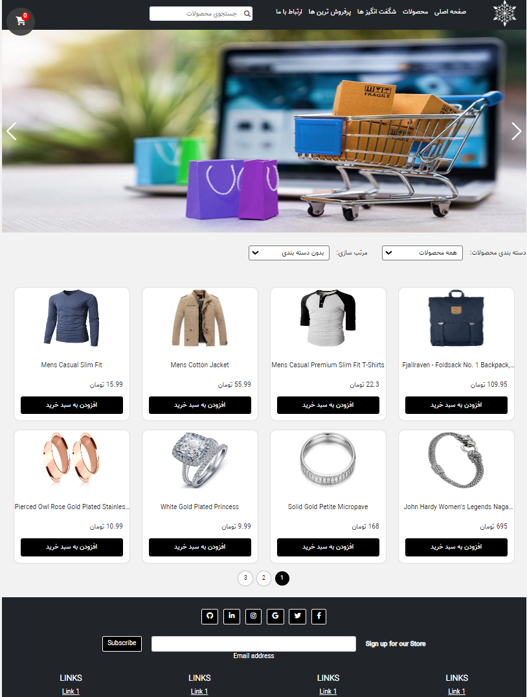

# My Store Project

This is a simple web project for creating an online store, implemented using HTML, CSS and JavaScript technologies. In order to create a responsive user interface compatible with different devices, the Bootstrap framework has been used. This project includes the main features of an online store such as products, shopping cart, etc.
## Demo
You can find a running demo here: 
[https://mywebproject.com](https://nasrinmzd.github.io/store-project/)

